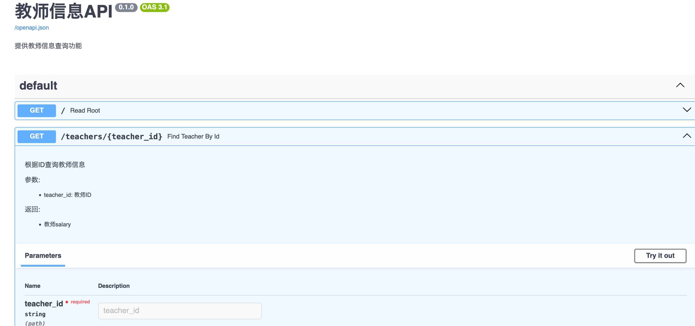

# FastAPI Demo

## 数据库配置

配置写在`.env`中，按需修改即可：

```
DB_NAME=mydb
DB_USER=postgres
DB_PASSWORD=
DB_HOST=localhost
DB_PORT=5432
```

## 运行

推荐使用`uv`运行，它会自动下载Python和相关依赖。

```bash
uv run main.py
```

这时打开浏览器的`localhost:8000/docs`，就可以看到如下：



点击`Try it out`，输入参数，点击`Execute`，就可以看到返回的结果了。
