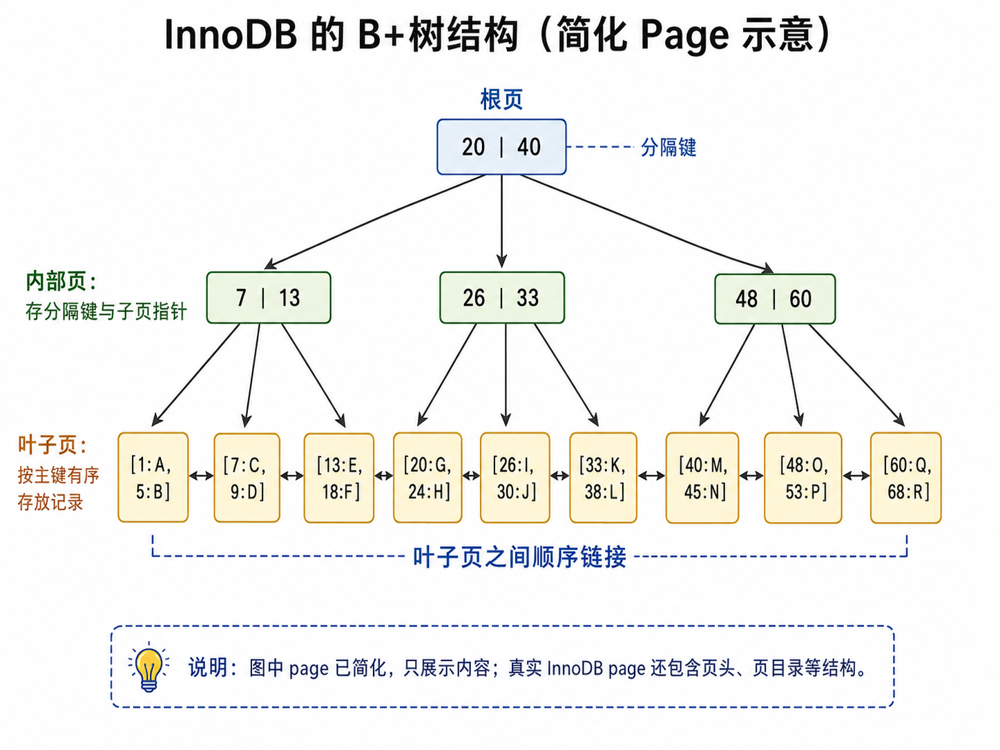

# 索引

在 [存储与索引](./storage_retrieval.md) 中，我们讨论了索引的基本概念，并看到 LSM 树和 B+树 两种结构。更一般地，索引分成两类：

- 有序索引（Ordered Index）：依赖某种排序
- 哈希索引（Hash Index）：依赖哈希函数

在讨论查询的时候，我们把用来查询的属性（或索引集合）叫 *search key*。但是注意：它和之前学过的 primary key、candidate key等概念并不关系。

比如，尽管 `dept_name` 并不是 key，但是它是 search key。

```sql
SELECT * FROM instructor WHERE dept_name = '计算机';
```

相对而言，哈希索引的逻辑比较简单，这里仅讨论以B+树为代表的有序索引。


## 有序索引

这里的“有序”指的是search key存在排序关系，像BST、B+树都是典型代表。

进一步，如果要求索引关联的记录本身也是有序的，那么此时它被称为 **聚簇索引**（clustering index）。在数据库中，由于page是读写单元，所以并不要求page内部有序。

>[!TIP]
> A clustering index is an index whose search key also defines the sequential order of the file.

聚簇索引也被称为 *primary index*，或 *clustered index*。注意，尽管名字叫 `primary index`，它和 `primary key` 没有任何关系。


### MySQL InnoDB

以 MySQL 的 InnoDB 存储引擎为例，它就是采用聚簇索引，其对应的 B+树的叶子节点存储了完整的记录（而不是指向记录的指针）。

常见情况：B+树的 search key 是主键（primary key）




### PostgreSQL

PostgreSQL 的 B+树索引则是非聚簇索引，叶子节点存储了 search key 和指向记录的指针（page id + slot id）。

非聚簇索引也被称为 *secondary index*，或 *non-clustered index*。

### 例子

以MySQL为例，它默认将主码作为聚簇索引。

```sql
CREATE TABLE instructor (
  ID INT PRIMARY KEY,
  name VARCHAR(20),
  age INT,
);
```

下面创建的索引是非聚簇索引：

```sql
CREATE INDEX idx_age ON instructor(age);
```


