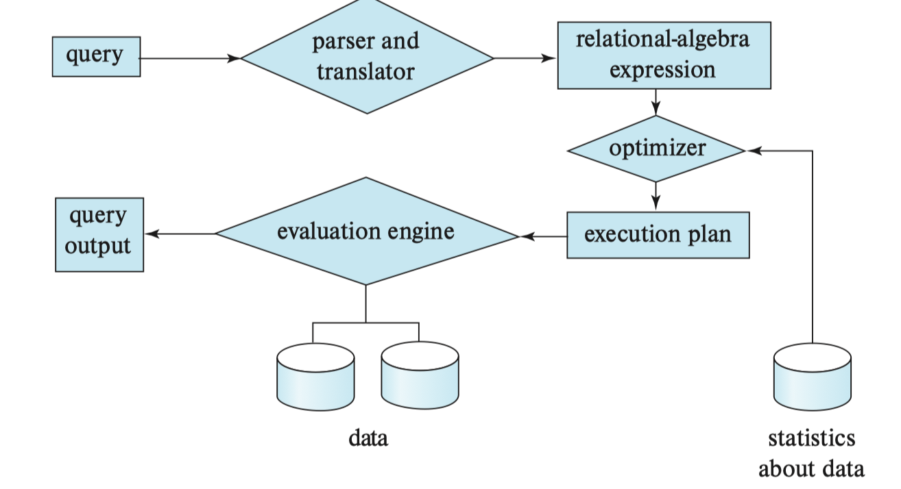

# 查询处理



查询处理（Query Processing）是数据库系统中将用户提交的 SQL 查询转换为可执行计划的过程。它包括以下几个主要阶段：

- 解析和翻译
- 查询优化
- 查询执行

考虑以下 SQL 查询：

```sql
select salary from instructor where salary < 75000;
```

这个查询可以对应两种关系代数表达式：

- $\Pi_{salary}(\sigma_{salary < 75000}(instructor))$
- $\sigma_{salary < 75000}(\Pi_{salary}(instructor))$

一般情况下，前者更高效，因为它先过滤掉不满足条件的记录，减少了后续投影操作的数据量。

## 查询代价：以SELECT为例

查询代价（Query Cost）是指执行一个查询所需的资源消耗，通常以时间或 I/O 操作次数来衡量。


>[!NOTE]
> 如果数据在内存或SSD，IO并不是决定性因素。这时需要考虑CPU的开销。这里为了简化分析，我们仍然以磁盘IO为主，忽略CPU开销。

### 1. 线性扫描

最简单的查询执行方法是线性扫描（Linear Scan），即从头到尾扫描整个表，检查每条记录是否满足条件。它的代价可以写成：

$$ t_S + b_r \times t_T $$

其中，$t_S$ 是磁盘寻道时间，$b_r$ 是表的页数，$t_T$ 是每页的传输时间。

### 2. 线性扫描 + 在Key上相等比较

平均情况下，线性扫描需要扫描表的一半，因此代价为：

$$ t_S + \frac{b_r}{2} \times t_T $$

### 3. 聚簇索引B+树 + 在Key上相等比较

$$ (h_i + 1) \times (t_S + t_T ) $$

其中，$h_i$ 是索引的高度（如果把空树高度看成-1）。


### 4. 聚簇索引B+树 + 在非Key上相等比较

非 Key 意味着满足条件的记录可能有多条；聚簇意味着这些记录在磁盘上连续存放。代价分两部分：

1. **走 B+ 树定位第一个匹配页**：$h_i \times (t_S + t_T)$
2. **连续读取所有匹配页**：$t_S + b \times t_T$

$$h_i \times (t_S + t_T) + t_S + b \times t_T$$

其中 $b$ 是包含匹配记录的页数。

**例子**：以 `instructor` 表为例，假设在 `dept_name`（系名）上建了聚簇索引：

```sql
-- dept_name 不是 Key（多个教师可属于同一个系）
SELECT * FROM instructor WHERE dept_name = 'Physics';
```

由于是聚簇索引，所有 `dept_name = 'Physics'` 的记录在磁盘上连续存放：

```
... [Music 记录们] [Physics 记录们] [Statistics 记录们] ...
                   ↑               ↑
              第一个匹配页      最后一个匹配页
              （需要 seek）    （顺序读完即可）
```

### 5. 非聚簇索引B+树 + 在Key上相等比较

$$ (h_i + 1) \times (t_S + t_T ) $$

### 6. 非聚簇索引B+树 + 在非Key上相等比较

$$ (h_i + n) \times (t_S + t_T ) $$

其中 $n$ 是满足条件的记录数。

**例子**：同样查询 `dept_name = 'Physics'`，但此时索引是**非聚簇**的，数据行在磁盘上随机分布：

```sql
SELECT * FROM instructor WHERE dept_name = 'Physics';
```

假设有 3 条 Physics 记录，它们散落在 3 个不同的页中：

```
B+ 树叶节点：Physics → [指针A, 指针B, 指针C]

磁盘页2: [...] [Physics, Wu, 90000]       ← 指针A，需要 seek
磁盘页7: [...] [Physics, Gold, 87000] [...] ← 指针B，需要 seek
磁盘页9: [...] [Physics, Katz, 62000] [...] ← 指针C，需要 seek
```

每条记录可能在不同的页，每次都需要重新寻道（seek + transfer），因此 $n$ 条记录就需要 $n$ 次 $(t_S + t_T)$，加上走 B+ 树的 $h_i$ 次，总代价为 $(h_i + n) \times (t_S + t_T)$。

----

## 实战

```sql
DROP TABLE IF EXISTS orders;

CREATE TABLE orders (
    oid        INT PRIMARY KEY,
    cid        INT NOT NULL,
    status     TEXT NOT NULL,
    amount     NUMERIC(10, 2) NOT NULL,
    created_at DATE NOT NULL
);
```

```sql
INSERT INTO orders
SELECT
    g AS oid,
    (g % 50000) + 1 AS cid,
    CASE
        WHEN g % 20 = 0 THEN 'cancelled'
        WHEN g % 5 = 0 THEN 'pending'
        ELSE 'paid'
    END AS status,
    ((g % 10000) / 10.0)::NUMERIC(10, 2) AS amount,
    DATE '2024-01-01' + (g % 730) AS created_at
FROM generate_series(1, 500000) AS g;
```

```sql
-- 收集统计信息
ANALYZE orders;
```

### 任务一：没有索引

```sql
EXPLAIN ANALYZE
SELECT *
FROM orders
WHERE status = 'cancelled';
```

观察结果:

- 观察查询计划中是否出现：`Seq Scan`。如果出现，说明 PostgreSQL 对 orders 表进行了顺序扫描。
- Rows Removed by Filter：表示扫描过程中被读取出来，但是不满足条件、最终被丢弃的行数。


### 任务二：在status上创建索引

```sql
CREATE INDEX idx_orders_status ON orders(status);

ANALYZE orders;

-- 关闭 Bitmap Scan，强制使用索引扫描
SET enable_bitmapscan = off;
```

比较下面的SQL：

```sql
EXPLAIN ANALYZE
SELECT *
FROM orders
WHERE status = 'cancelled';
```

```sql
EXPLAIN ANALYZE
SELECT *
FROM orders
WHERE status = 'paid';
```

> 注意：即使已经建立了索引，PostgreSQL 也不一定会使用它。

思考：为什么 `paid` 可能不使用索引？