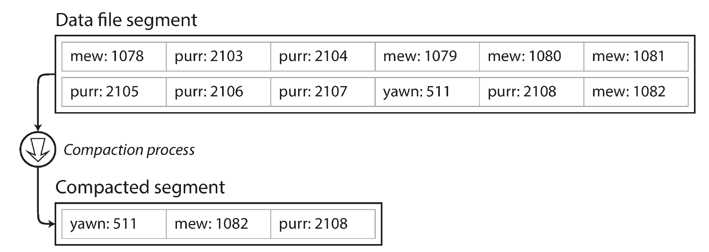
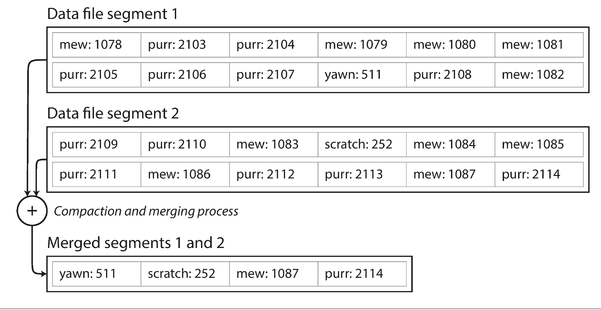
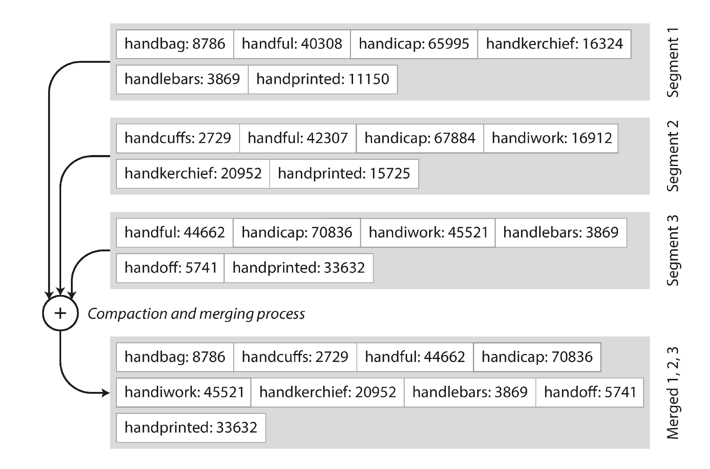
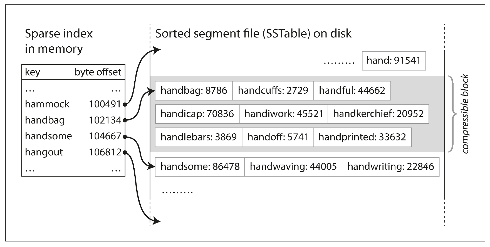
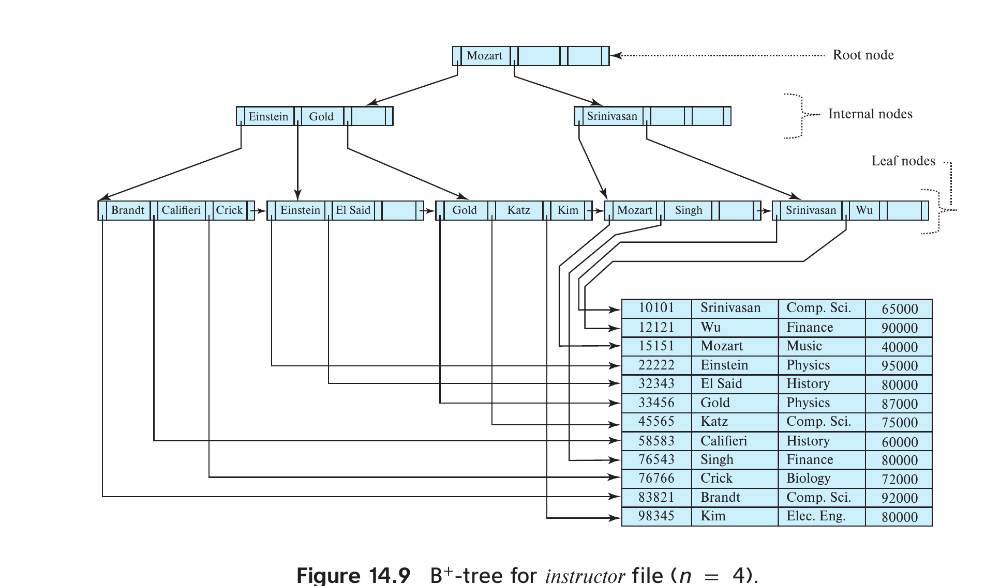
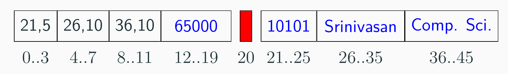
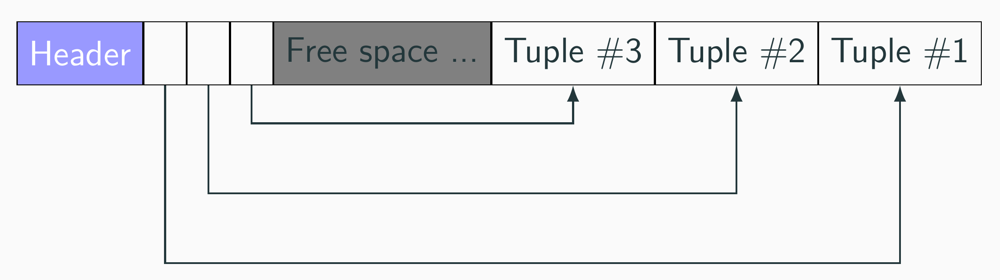

# 存储和检索
（本文档改编自《Designing Data-Intensive Applications》）

>[!NOTE]
> 这里我们讨论更广义的 **数据库**，而不是特指关系型数据库。

从第一性原理出发，一个数据库只做两件事情：1）当你给它数据，它能存储；2）当你问它数据，它能检索。

即使作为一名应用程序员，理解数据库的存储和检索机制也很重要。它可以帮助你选择合适的数据库，设计更高效的数据模型，并编写更快的查询。一个典型的场景是：**事务型（transactional）的负载和分析型（analytical）的负载对数据库的存储和检索机制有不同的要求。**

## 1. 从数据结构到数据库

实现一个数据库很难？确实如此，它基本上是世界上最复杂的软件系统之一。但如果根据上述第一性原理来构建一个最简数据库（`DogDB`），它只有几行代码：

```python
DB_NAME = 'dog.db'
def store(key, value):
    with open(DB_NAME, 'a') as f:
        f.write(f'{key}:{value}\n')
def retrieve(key):
    with open(DB_NAME, 'r') as f:
        for line in f:
            k, v = line.strip().split(':', 1)
            if k == key:
                return v
    return None
```

```java
static final String DB_NAME = "dog.db";

static void store(String key, String value) throws IOException {
    try (var w = new FileWriter(DB_NAME, true)) {
            w.write(key + ":" + value + "\n");
    }
}

static String retrieve(String key) throws IOException {
    var db = new File(DB_NAME);
    if (!db.exists()) return null;
    String result = null;
    try (var r = new BufferedReader(new FileReader(db))) {
        String line;
        while ((line = r.readLine()) != null) {
            int sep = line.indexOf(':');
            if (sep != -1 && line.substring(0, sep).equals(key))
                result = line.substring(sep + 1);
        }
    }
    return result;
}
```

>[!TIP]
> 思考1：上面两个核心操作，其时间复杂度是多少？

特别地，上面的`store`操作尽管非常简单，但它在真实系统中非常常见，被广泛应用在日志（log）中。日志系统的核心就是不断地将数据追加（append）到文件末尾，这样的设计使得日志系统非常高效，能够处理大量的数据写入。“日志”一词一般指记录程序运行状态的文本文件，而在数据结构的场景下，它更强调其**append-only**的特性，即只能在文件末尾追加数据。

由于上面简单的`retrieve`操作很慢，因此我们需要引入**索引**（index）来加速检索。因为索引也是数据，但并不是原始业务数据，它属于**元数据**（metadata），即*描述数据的数据*。

>[!TIP]
> 思考2：一旦引入了索引，写操作是否通常会变慢？

### （1）哈希索引

上述键值对数据在很多编程语言中被称为 *dict*，其实现机制就是哈希表。因此，使用哈希索引来加速查询是一个自然的选择。

索引的一个要求是它应该足够轻量，以便在内存中存储。因此，索引通常只包含键和指向数据位置的指针，而不包含值本身。对于上面的`DogDB`，我们可以在内存中维护一个哈希表来存储键和文件偏移量（*offset*）的映射。

考虑真实数据：

```
1:Bob\n
42:{"name": "Alice", "age": 30}\n
333:{"name": "Charlie", "age": 25, "city": "New York"}\n
```

这三条记录在文件中偏移量分别是：0、6、38。我们可以在内存中维护一个哈希表：

```python
{
    "1": 0,
    "42": 6,
    "333": 38
}
``` 

尽管上述方案看起来很简单，它在真实系统中（比如[Riak](https://riak.com/index.html)）是被广泛使用的。

进一步，考虑考虑数据更新的场景。由于我们使用了**append-only**的日志结构，更新数据实际上是追加一条新的记录，并在索引中更新键的偏移量指向新的记录。这样，旧的记录就成为了**垃圾**（garbage），需要定期进行**垃圾回收**（garbage collection）来清理这些无用的数据。这个清理的过程一般被称为**压缩**（compaction）。

此外，基于日志结构的数据系统中，一般会将一个*log*分成多个*segment*。当一个*segment*达到一定大小时，就会创建一个新的*segment*来继续写入数据。这样做的好处是可以更好地管理数据文件，避免单个文件过大导致的性能问题。我们说的**compaction**，一般是指segment内部的压缩。每个segment都有自己的索引文件，查询的时候先使用最新segment对应的索引。



除了segment内部的压缩，还可以执行**合并**（merge），将多个segment合并成一个新的segment（旧的segment可以直接删除）。合并的过程会将多个segment中的数据进行排序，并去除重复的记录（即保留最新的记录）。合并可以进一步减少垃圾数据，提高查询效率。

下面是同时执行压缩和合并的示例图:



>[!TIP]
> 思考3：上述设计中，如何支持删除操作？


尽管上面的设计已经非常简单，但它仍然存在一些问题：

- 哈希表必须在内存中。如果数据量太大，可能会导致内存不足（尽管可以在磁盘中实现哈希表，但性能会大幅下降）。
- 哈希表不支持范围查询（range query），即无法高效地查询某个范围内的键值对，比如“查询年龄在3到10之间的狗”。

>[!TIP]
> 思考4：由于哈希表在内存中，如果系统崩溃了，所以会丢失索引数据。如何解决这个问题？

### （2）SSTable和LSM树

本节的内容对本科生比较高阶，但理解它对于理解现代数据库（如LevelDB、RocksDB）的设计非常重要。

在上述segment的基础上，我们要求一个额外的条件：每个segment中的key必须是**有序的**（sorted）。每个segment都对应一个**SSTable**（Sorted String Table）。进一步，我们要求一个segment内的key是唯一的（这可以通过compaction来保证）。

>[!TIP]
> 思考5：对于SSTable Segments，如何高效合并？



SSTable还有一个好处是，它对应的索引更小。考虑一个SSTable Segment，我们不再需要为每个key维护一个偏移量；而是记录部分key的偏移量（比如每几KB的数据块的第一个key）。比如要查找`hardiwork`这个key对应的信息，我们先通过索引确定它在`handbag`和`handsome`之间，这样读取该数据块扫描即可。



上面那样的索引属于**稀疏索引**（sparse index）。

> A sparse index is a specialized database indexing technique that only contains index entries for a subset of records, rather than every single record.

#### SSTable的细节

在内存中，如何保证数据有序呢？选择有很多，比如AVL树、红黑树等平衡搜索树（balanced search tree）。


下面是整个存储引擎的工作原理：

- 写入数据时，首先写入到内存中的平衡树结构（如红黑树）。这个数据结构经常被称为 *memtable*。
- 当memtable达到一定大小时（一般只有几MB），将其内容写入磁盘，形成一个新的SSTable文件。由于内存结构是有序的，SSTable天然也是有序的。
- 读取数据时，优先在memtable中查找，如果没有找到，再按照时间顺序从最新的SSTable开始查找，直到找到目标key或者所有SSTable都被查找过。
- 在后台执行compaction和merge来优化存储结构。

基于上述在有序文件上compacting和merging的数据引擎被称为LSM树（Log-Structured Merge Tree）。

### （3）B树

尽管上述LSM树在近些年备受关注，但最经典的数据库索引还是B树（B-Tree）。自1970被提出以来，B树及其变种B+树已经成为了关系型数据库（如MySQL、PostgreSQL）的默认索引结构。下面仅介绍B+树。



对于特定的B+树，n是固定的。显然，每个结点至多有n-1个检索键（search key），$K_1 < K_2 < ... < K_{n-1}$。

- 根结点有2到n个子结点。
- 每个非根结点有n/2到n个子结点。

>[!TIP]
> 思考6：B+树如何支持查询Einstein的信息？

>[!TIP]
> 思考7：B+树如何支持查询Einstein到Gold的信息？


可以证明，B+树的高度是$O(log_{(n/2)}{N})-1$，其中N是树中存储的键值对的数量。


假设搜索键是32字节，指针是8字节，一个结点大小（一般是4KB），n大概是100。对于一个包含1百万条记录的数据库，B+树的高度大约是3，这意味着查询一个键值对最多需要4次磁盘访问（根结点、两个中间结点、叶子结点）。

实战：

```sql
CREATE TABLE test_index(
id int,
name varchar(100)
);

INSERT INTO test_index(id, name)
(SELECT generate_series(0, 1000000),
gen_random_uuid());

EXPLAIN ANALYZE SELECT * FROM test_index
WHERE id BETWEEN 100 AND 500;

CREATE INDEX id_idx ON test_index(id);

EXPLAIN ANALYZE SELECT * FROM test_index
WHERE id BETWEEN 100 AND 500;
```

>[!NOTE]
> 默认会将主码（primary key）作为B+树索引，因此如果`id`是主码，那么它已经有了一个B+树索引了，不需要创建。

## 2. 列式存储

上面的哈希索引、LSM树、B+树，主要讨论的是“如何更快按键检索一行或一批行”。
但在真实业务里，还存在另一类高频需求：

- 统计过去30天每天的销售额
- 按城市、渠道、品类做聚合分析
- 在几十亿行数据里筛选一小部分列并做`GROUP BY`

这类负载一般称为分析型负载（OLAP）。它和事务型负载（OLTP）最大的不同是：**单次查询往往扫描大量行，但只使用少量列**。

### （1）行式 vs 列式：到底变了什么？

假设有一张订单表：

| order_id | user_id | city | amount | ts |
|---|---|---|---|---|
| 1 | 101 | CD | 99.5 | 2026-05-01 |
| 2 | 102 | SH | 19.9 | 2026-05-01 |
| 3 | 101 | CD | 39.9 | 2026-05-02 |

行式存储（row-oriented）在磁盘上大致是：

```
[1,101,CD,99.5,2026-05-01][2,102,SH,19.9,2026-05-01][3,101,CD,39.9,2026-05-02]...
```

列式存储（column-oriented）在磁盘上大致是：

```
order_id: [1,2,3,...]
user_id : [101,102,101,...]
city    : [CD,SH,CD,...]
amount  : [99.5,19.9,39.9,...]
ts      : [2026-05-01,2026-05-01,2026-05-02,...]
```

假设查询是：

```sql
SELECT city, AVG(amount)
FROM orders
WHERE ts >= '2026-05-01'
GROUP BY city;
```

这个查询只需要`city`、`amount`、`ts`三列。列式存储可以主要读取这三列，而不是整行全部字段，从而显著减少I/O。

### （2）列式为什么快？

结合 MotherDuck 的总结，列式在分析场景的性能优势主要来自四点。

1. 减少I/O（最核心）

只读需要的列，避免把无关字段从磁盘搬到内存。分析查询经常是“宽表少列访问”，这时收益很大。

2. 压缩率更高

同一列的数据类型一致、分布更集中，熵更低，容易压缩。常见手段包括：

- 字典编码（dictionary encoding）
- 游程编码（RLE, Run-Length Encoding）
- 位打包（bit-packing）
- 面向字符串的专门压缩算法

压缩率高不仅省存储，也会减少读盘字节数，因此通常还能进一步提速。

3. 聚合更高效

`SUM/AVG/COUNT`这类操作会在同一列的连续内存块上循环，CPU cache 命中率更高。

4. 更适合向量化执行

现代引擎常按“向量（批量）”而不是“逐行”执行算子，能更好利用 SIMD 与流水线，降低解释器/函数调用开销。

>[!TIP]
> 思考9：为什么“压缩”在列式系统里经常会同时提升“成本”和“性能”？

### （3）什么时候优先用列式？什么时候不该用？

更适合列式的场景：

- 读多写少，且以分析查询为主（OLAP）
- 表很宽，但查询通常只访问少量列
- 需要低成本存储大规模历史数据

不适合或需要谨慎的场景：

- 高频单行写入/更新/删除（典型OLTP）
- 高并发短事务、强实时点写
- 频繁`SELECT *`并返回整行（会放大“拼回行”的成本）
- 数据量很小（元数据与执行开销可能抵消收益）
## 3. 存储细节

前面两节讨论的是"数据结构层面"的存储与索引。本节则深入 DBMS 实现层，介绍数据库如何真正地在磁盘上组织、存储数据。

### （1）存储层级与延迟

主流数据库是基于**磁盘**（非易失存储）的，计算时需要将数据从磁盘读入**内存**（易失存储）。不同存储介质之间的访问延迟差异极大：

| 存储介质 | 实际延迟 | 类比（将 L1 Cache 设为 1 秒） |
|---|---|---|
| L1 Cache | 1 ns | 1 秒 |
| L2 Cache | 4 ns | 4 秒 |
| DRAM | 100 ns | 100 秒 |
| SSD | 16,000 ns | 4.4 小时 |
| HDD | 2,000,000 ns | 3.3 周 |

> 数据来源：[Latency Numbers Every Programmer Should Know](https://colin-scott.github.io/personal_website/research/interactive_latency.html)

此外，磁盘不适合随机访问。因此在设计 DBMS 时，需要尽可能**连续**访问，而不是**随机**访问。两个核心问题是：
- DBMS 如何在磁盘中存储数据？
- DBMS 如何管理内存并与磁盘来回移动数据？

### （2）文件与 Page

DBMS 将数据库存储为若干文件（尽管使用自定义格式，连操作系统通常也不知道文件内容的含义）。这些文件被组织成一组固定大小的数据块，称为 **page**。

> A page is a fixed-size block of data.

注意"page"在不同层次有不同含义：
- 硬件 page：一般是 4 KB
- OS page：一般是 4 KB
- DB page：4 KB–16 KB（例如 SQLite 4 KB、PostgreSQL 8 KB、MySQL InnoDB 16 KB）

实战：

```sql
-- 查看 page 大小
SHOW block_size;

CREATE TABLE storage_test (id serial, data text);
INSERT INTO storage_test (data)
  SELECT gen_random_uuid()::text FROM generate_series(1, 1000);

-- 找到数据文件路径
SELECT pg_relation_filepath('storage_test');

-- 查看文件大小（应该是 8KB 的整数倍）
SELECT pg_size_pretty(pg_relation_size('storage_test'));
```

一般来说，一条记录被存储在一个page中，不会跨页存储。

### （3）Page 的组织

DBMS 可以使用不同的方式组织 pages：

- **堆文件组织**（heap file organization）：page 无序堆放，是最常见的默认方式
- 树文件组织
- 顺序文件组织
- 哈希文件组织

堆文件（heap file）是 page/record 的无序集合，元组随机存储。当需要插入变长记录时，DBMS 需要知道哪个 block 有足够空间。大多数 DBMS 都维护一个 **free-space map**，用于追踪每个 block 的空余空间。例如在 PostgreSQL 中，每个元素占一个字节，其值除以 256 即为该 block 的空闲比例。

### （4）Page 的内容

每个 page 由 **header** 和 **data** 两部分构成。header 是描述该 page 内容的元数据，包含：

- page 大小
- 校验和（checksum）
- DBMS 版本
- 压缩信息
- ……

**定长元组的 page layout**：如果元组都是定长的，最大的难点是如何记录被删除的元组。一种方案是使用 *free list*：维护一个链表，记录哪些槽位已被释放可以复用。

**变长元组的 page layout**：当数据含有变长字段（如 `varchar`、`text`）时，通常使用 $(offset, length)$ 来标记变长字段的位置。下面是`(id, name, dept_name, salary)`，其中仅`salary`是定长字段：




为了高效管理变长元组，最常用的结构是**分槽页**（slotted pages）：使用一个 slot array 记录每个元组的起始位置和大小，元组从 page 尾部向前增长，slot array 从头部向后增长，中间是空闲空间。



PostgreSQL 的 slotted page 设计可参考：<https://www.postgresql.org/docs/current/storage-page-layout.html>

### （5）物理元组 ID

DBMS 通常会给每个逻辑元组分配一个**物理元组 ID**（physical tuple ID），用于唯一标识一条记录的物理位置。各数据库的实现方式不同：

| 数据库 | 行 ID 列名 |
|---|---|
| Oracle | ROWID |
| SQLite | ROWID |
| PostgreSQL | CTID |
| MySQL | N/A |

在 PostgreSQL 中，`CTID` 是一个二元组 `(page_id, slot_id)`，可以直接查询：

```sql
SELECT CTID FROM student;
```

实战：
```sql
SELECT ctid, id FROM storage_test LIMIT 5;

-- 更新一行，观察 CTID 是否改变
UPDATE storage_test SET data = 'changed' WHERE id = 3;
SELECT ctid, id FROM storage_test WHERE id = 3;
```

### （6）大对象存储

> Many databases internally restrict the size of a record to be no larger than the size of a block.

SQL 支持 `blob`（二进制大对象）和 `clob`（字符大对象）类型。然而，很多 DBMS 要求 **记录的大小不能超过一个 page 的大小** 。当需要存储大对象时，DBMS 会将大对象单独存放在溢出页（overflow page）中，在原始记录里只保存一个指针。

PostgreSQL 的溢出页机制称为 **TOAST**（The Oversized-Attribute Storage Technique）。当某列数据超过约 2 KB 时，PostgreSQL 会自动将其压缩或移出到一个隐藏的 TOAST 表中，原始 page 只保留一个指针。每张表都对应一个 TOAST 表，可以通过 `pg_class.reltoastrelid` 找到。

实战：

```sql
-- 1. 创建测试表
CREATE TABLE toast_test (id serial, content text);

-- 2. 插入小数据（不触发 TOAST）
INSERT INTO toast_test (content) VALUES (repeat('a', 100));

-- 3. 插入大数据（触发 TOAST，阈值约 2 KB）
INSERT INTO toast_test (content) VALUES (repeat('x', 100000));

-- 4. 查看记录的 CTID（大数据行与小数据行同在主表中）
SELECT ctid, id, length(content) FROM toast_test;

-- 5. 对比原始大小与实际存储大小
--    未触发 TOAST 的行：stored_bytes ≈ original_bytes
--    触发 TOAST 的行：stored_bytes << original_bytes
SELECT id,
       length(content)         AS original_bytes,
       pg_column_size(content) AS stored_bytes
FROM toast_test;
```

### （7）数据字典（Metadata）

一个数据库有多张表，表的数据分布在若干 page 中。当执行 `SELECT * FROM student` 时，DBMS 如何知道该去读取哪个文件？

每个 DBMS 都维护一个**数据字典**（data dictionary），用于存储数据库的元数据，包括表、索引与对应文件的映射关系。例如在 PostgreSQL 中，可以通过系统表查询：

```sql
SELECT 
    tablename,
    pg_relation_filepath(schemaname||'.'||tablename) AS file_path
FROM pg_tables 
WHERE tablename = 'student'
  AND schemaname = 'public';
-- 结果示例：student, base/16384/16454

SELECT attname, atttypid::regtype, attlen, attnotnull
FROM pg_attribute
WHERE attrelid = 'storage_test'::regclass AND attnum > 0;
```

### （8）内存、缓冲池与磁盘

由于磁盘 I/O 代价极高，DBMS 在内存中维护一个**缓冲池**（buffer pool）来缓存磁盘上的 page。其核心机制包括：

- **Page Table**：记录当前哪些 page 已被加载到内存，以及它们在内存中的位置。
- **缓冲替换策略**（Buffer Replacement Policy）：当缓冲池满了需要腾出空间时，决定换出哪个 page。常见策略包括 LRU（最近最少使用）等。